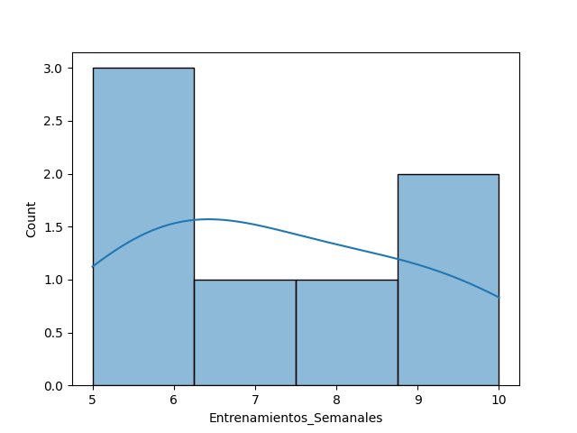
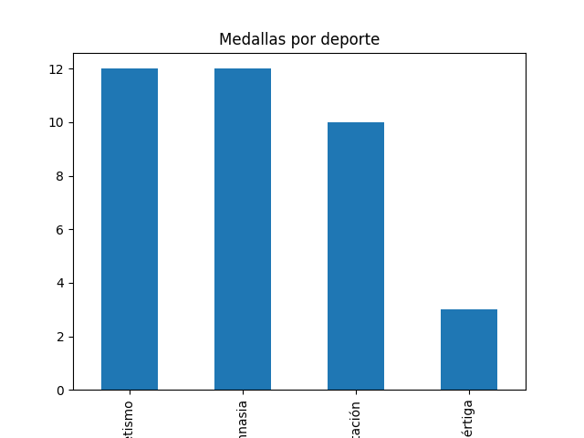
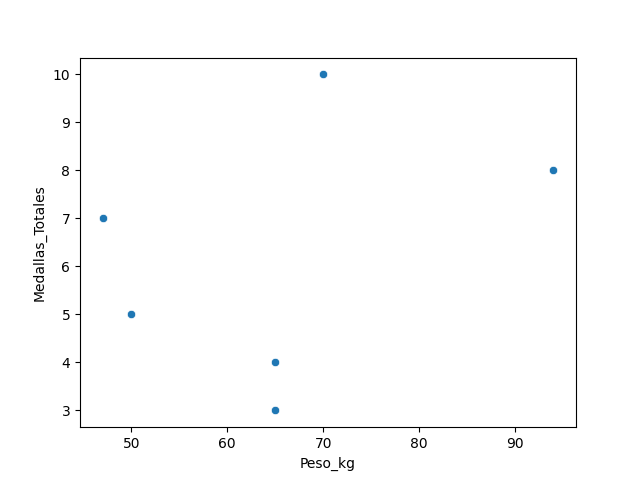
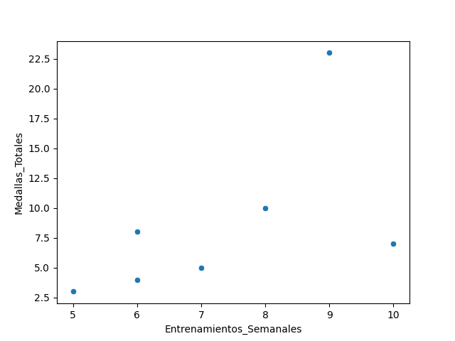
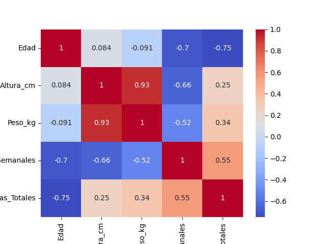

# 🏅 Olympic Athletes Performance Analysis

## 🧠 Problema de negocio
En el alto rendimiento deportivo, entender qué factores impactan el éxito olímpico permite optimizar entrenamientos, selección de atletas y estrategias deportivas.

Este proyecto busca responder:
> **¿Qué variables influyen realmente en la obtención de medallas?**

---

## 🎯 Objetivo
- Identificar relaciones entre variables físicas y desempeño
- Analizar patrones por disciplina deportiva
- Evaluar el impacto del entrenamiento en los resultados
- Construir un modelo predictivo de medallas
- Desplegar un dashboard interactivo para exploración

---

## 📂 Dataset
Dataset de atletas olímpicos con variables clave:

- Edad  
- Altura (cm)  
- Peso (kg)  
- Deporte  
- Entrenamientos semanales  
- Medallas totales  
- País  

---

## ⚙️ Pipeline de análisis

1. **Data Cleaning**
   - Eliminación de valores nulos
   - Detección de outliers (IQR)

2. **EDA (Análisis Exploratorio)**
   - Distribuciones
   - Correlaciones
   - Comparaciones por deporte

3. **Modelado**
   - Regresión Lineal
   - Evaluación con R²

4. **Visualización**
   - Gráficos exploratorios
   - Heatmap de correlación

5. **Dashboard**
   - Aplicación interactiva con Streamlit

---

## 📊 Insights clave (basados en datos)

- Existe una **relación positiva entre entrenamientos semanales y medallas**, pero no es completamente lineal.
- **Natación presenta alta variabilidad**, indicando influencia de factores adicionales.
- **Altura y peso están altamente correlacionados**, pero no determinan directamente el número de medallas.
- Deportes con múltiples eventos tienden a concentrar mayor número de medallas.

👉 **Conclusión:** El éxito olímpico es multifactorial y depende tanto del entrenamiento como del contexto competitivo.

---

## 📈 Visualizaciones

### Distribución de variables


### Medallas por deporte


### Relación peso vs medallas


### Relación entrenamiento vs medallas


### Correlación entre variables (Heatmap)


---

## 🤖 Modelo predictivo

**Algoritmo:** Regresión Lineal  

- Variables utilizadas:
  - Edad
  - Altura
  - Peso
  - Entrenamientos

- Métrica:
  - **R²: -1602**

👉 El resultado de R² negativo (-1602) obtenido por el modelo de regresión lineal indica un desempeño significativamente peor que un modelo base que predice la media.

Este resultado se explica por:
- Tamaño de muestra extremadamente reducido
- Alta variabilidad en la variable objetivo (medallas)
- Posible eliminación de datos por tratamiento de outliers
- Suposición de linealidad no adecuada

👉 Por lo tanto, el modelo no es confiable para predicción en su estado actual.

Sin embargo, el ejercicio permite validar el pipeline de modelado y evidencia la necesidad de:
- Mayor volumen de datos
- Feature engineering
- Modelos más robustos

---

## 🚀 Dashboard interactivo

Ejecuta el dashboard con:

```bash
streamlit run app.py
```

---

## 📂 Estructura del proyecto
```bash
olympic-analysis/
│
├── data/
│   └── athletes.csv
│
├── outputs/
│   ├── graficos/
│   │   ├── distribuciones.png
│   │   ├── medallas_deporte.png
│   │   ├── entrenamiento_medallas.png
│   │   ├── heatmap.png
│
├── src/
│   ├── cleaning.py
│   ├── eda.py
│   ├── model.py
│
├── app.py              # Dashboard Streamlit
├── main.py             # Pipeline completo
├── requirements.txt
└── README.md
```

---

## ▶️ Cómo ejecutar el proyecto
```bash
git clone https://github.com/IsaUrdaneta/olympic-analysis.git
cd olympic-analysis

python -m venv venv
source venv/Scripts/activate   # Windows

pip install -r requirements.txt

# Ejecutar pipeline
python main.py

# Ejecutar dashboard
streamlit run app.py
```

---

## 🧪 Próximas mejoras
- Implementar modelos avanzados (Random Forest, XGBoost)
- Feature engineering (IMC, ratios de entrenamiento)
- Validación cruzada
- Deploy en Streamlit Cloud


## 👩‍💻 Autora
Isanevys Urdaneta

Data Analyst | Data Scientist